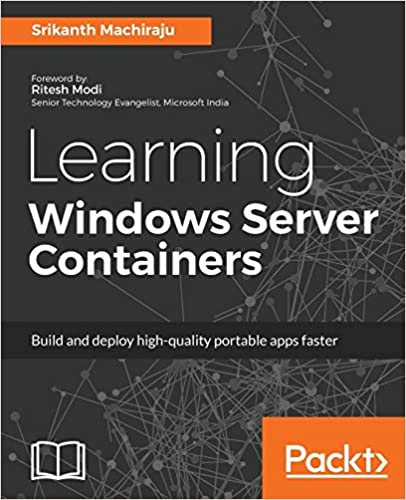
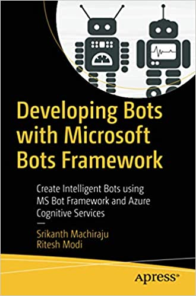
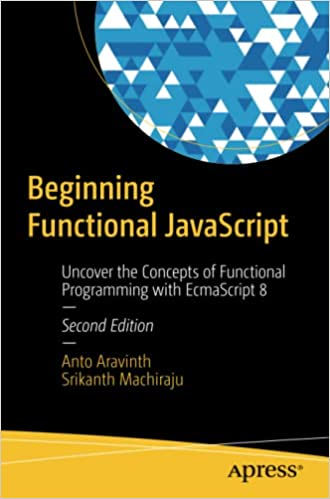

### Hi there 👋

I'm Srikanth Machiraju an Architect at [Microsoft](https://www.microsoft.com/en-in), Published Author and Research Student. I'm currently learning distributed machine learning and Artifical intelligence. I create a blend of my expertise in building cloud native solutions with AI / ML to create innovate products. I also write articles on [linked-in](https://www.linkedin.com/in/vishsrik/) and [towards datascience](https://medium.com/@vishwanath.srikanth) related to cloud native architecture and datascience.   

Here are some of the books I authored.

||||
|-|-|-|
||||

📫 How to reach me:
Write to vishwanath.srikanth@mail.com

👯 I’m looking to collaborate on research work related to reinforcement learning.

⚡ Fun fact:
I'm actually not that busy as it appears :)

<!--
**sriksmachi/sriksmachi** is a ✨ _special_ ✨ repository because its `README.md` (this file) appears on your GitHub profile.

Here are some ideas to get you started:

- 🔭 I’m currently working on ...
- 🌱 I’m currently learning ...
- 👯 I’m looking to collaborate on ...
- 🤔 I’m looking for help with ...
- 💬 Ask me about ...
- 📫 How to reach me: ...
- 😄 Pronouns: ...
- ⚡ Fun fact: ...
-->
