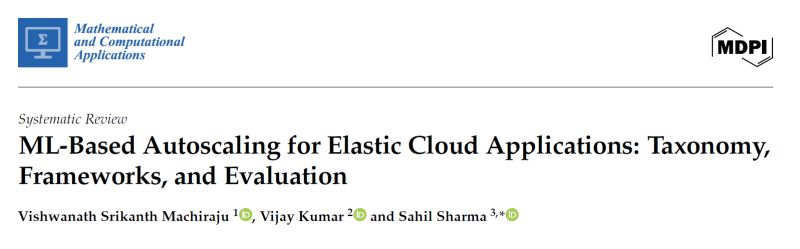
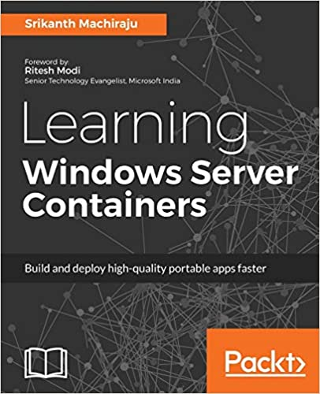
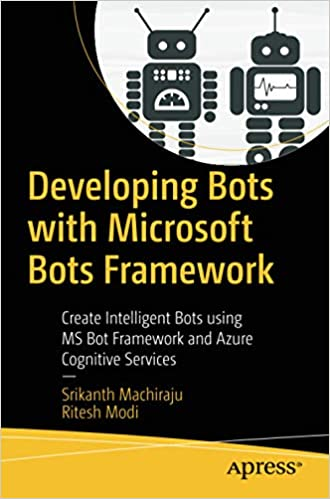
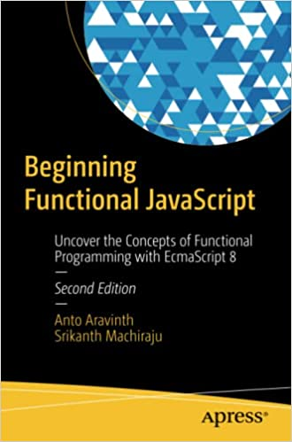

## 👋 Hello World! I'm Srikanth Machiraju

🎯 **AI Architect @ Microsoft** | 📚 **Published Author** | 🔬 **Published Researcher**

> *"Bridging the gap between cutting-edge AI research and real-world applications through innovative cloud-native solutions"*

I'm passionate about building the next generation of intelligent systems that transform industries. My expertise spans **Large Language Models**, **Deep Reinforcement Learning**, and **Distributed ML Systems**. I architect scalable AI solutions on the cloud while contributing to the AI community through research, writing, and open-source projects.

### 🤖 What I Do
- 🏗️ **Architect AI Solutions** at scale for enterprise applications
- 📝 **Write Technical Content** on [LinkedIn](https://www.linkedin.com/in/vishsrik/) and [Medium](https://techtalkwithsriks.medium.com/)
- 🔬 **Research** in Deep Reinforcement Learning and Industrial Automation
- 🌟 **Mentor** developers building intelligent applications

---

## � Research Publications

*Peer-reviewed research contributing to the AI/ML and cloud systems community*

### ML‑Based Autoscaling for Elastic Cloud Applications: Taxonomy, Frameworks, and Evaluation

> **Published in:** [Mathematical and Computational Applications (MCA)](https://www.mdpi.com/journal/mca), MDPI — *Special Issue: 30th Anniversary of MCA*

This paper presents a systematic taxonomy and evaluation of machine learning–driven autoscaling approaches for elastic cloud systems, spanning **classical ML**, **deep learning**, and **reinforcement learning**. By synthesizing insights from extensive prior research, it highlights key design patterns, evaluation metrics, and open challenges in building scalable and efficient cloud-native systems.

**Co-authors:** Srikanth Machiraju · Sahil Sharma, PhD, AFHEA · Vijay Kumar

| 📰 Full Paper | 📥 PDF |
|:---:|:---:|
| [Read on MDPI →](https://www.mdpi.com/2297-8747/31/2/49) | [Download PDF →](https://www.mdpi.com/2297-8747/31/2/49/pdf) |

---

## �📚 Published Author - Books That Inspire Innovation

*Sharing knowledge through comprehensive guides on AI and cloud technologies*

|                                                            |                                                            |                                                            |
| ---------------------------------------------------------- | ---------------------------------------------------------- | ---------------------------------------------------------- |
|  |  |  |

📫 How to reach me:
Write to vishwanath.srikanth@mail.com / ping me on [linked-in](https://www.linkedin.com/in/vishsrik/)

👯 I’m looking to collaborate on research work related to reinforcement learning.

⚡ Fun fact:
I'm actually not as busy as it appears :)

**sriksmachi/sriksmachi** is a ✨ AI/ML ✨ repository where you can find all my work.

Here are some ideas to get you started:

- 🔭 I’m currently working on applied RL
- 🌱 I’m currently learning distributed ML systems
- 👯 I’m looking to collaborate on RL in the field of industrial automation
- 🤔 I’m looking for help with ...
- 💬 Ask me about ML/DS/AI, designing distributed systems for the cloud, microservices design 

## 🏗️ My Work Portfolio

> *"Where Applied Research solves real-business problems"*

The **sriksmachi** repository is a ✨ **comprehensive AI/ML knowledge hub** ✨ showcasing production-ready solutions, research implementations, and educational resources. Each section below contains battle-tested examples, interactive notebooks, and mini-projects applicable across industries.

### 🌟 **Featured Projects**

*Real-world applications showcasing AI innovation in action*

| 🚀 **Project**   | 🔗 **Repository**                                                                              | 💡 **Innovation**                       |
| --------------- | ---------------------------------------------------------------------------------------------------------------- | -------------------------------------- |
| 🤖 **Multi-Agent AI System** | [View Project →](https://github.com/sriksmachi/multi-agent-ai-system-lang-accelerator) | Language acceleration for multi-agent systems |
| 🚕 **SuperCabs** | [View Project →](https://github.com/sriksmachi/supercabs)                                     | RL/Q-Learning-based decision framework for car-rental services like uber, that maximises profit          |
| 🏢 **RBEI**      | [View Project →](https://github.com/sriksmachi/rbei)                                          | YOLO-based household object detection for edge devices & smart cleaning robots |
| 🔷 **Azgentica**  | [View Project →](https://github.com/sriksmachi/azgentica)                                    | Vision-powered AI agent transforming Azure architecture diagrams into structured insights & cost analysis |

---

## 🔬 Current Research

**Reinforcement Learning & Distributed ML Systems**
- Exploring advanced techniques in RL applications for industrial automation [supply chain orders] and intelligent systems [RL-based decision system for AI trading with market sentiment analysis]
- Focusing on distributed training and large-scale model optimization
- Active experimentation with multi-agent systems and language model acceleration

**Research Interests:**
- 🤖 Deep Reinforcement Learning applications in robotics and automation
- 🔄 Distributed training for large-scale AI systems
- 🤝 Multi-agent AI systems and coordination
- ⚡ Language model optimization and acceleration techniques
- ☁️ Cloud-native distributed ML architectures
- 📈 ML/RL-based autoscaling for elastic cloud systems

**How to Engage:**
- 💬 Interested in collaborating on RL research? Reach out via [LinkedIn](https://www.linkedin.com/in/vishsrik/)
- 📝 Follow my research explorations on [Medium](https://techtalkwithsriks.medium.com/)
- 🔗 Explore my active research repositories above

-----

### 🎯 **Code samples by AI/ML Topics**

The following links point you to AI ML topics that that can be learnt in 30 minutues with code and examples. 

| 🔥 **Domain**                     | 🚀 **Repository**                                                                    | 📊 **Focus Area**               |
| -------------------------------- | ----------------------------------------------------------------------------------- | ------------------------------ |
| 🌐 **Azure ML**                   | [Explore →](https://github.com/sriksmachi/sriksml/tree/main/azureml)                | Cloud-native ML solutions      |
| 🧠 **Large Language Models**      | [Explore →](https://github.com/sriksmachi/sriksml/tree/main/genai-labs)        | LLM applications & fine-tuning |
| 📈 **Classical Machine Learning** | [Explore →](https://github.com/sriksmachi/sriksml/tree/main/classical-ml-labs)           | Traditional ML algorithms & Concepts      |
| 🎮 **Reinforcement Learning**     | [Explore →](https://github.com/sriksmachi/sriksml/tree/main/reinforcement-learning-labs) | Reinforcement learning concepts & applications     |

---

## 📊 GitHub Analytics

---

## 🛠️ Tech Stack & Expertise

### 🤖 **AI/ML Technologies**

### ☁️ **Cloud & DevOps**

### 💻 **Programming & Tools**

---

### 🌟 *"Innovation happens when AI meets real-world challenges"*

**⭐ Star my repositories if you find them useful!**  
**🤝 Let's build the future of AI together!**

